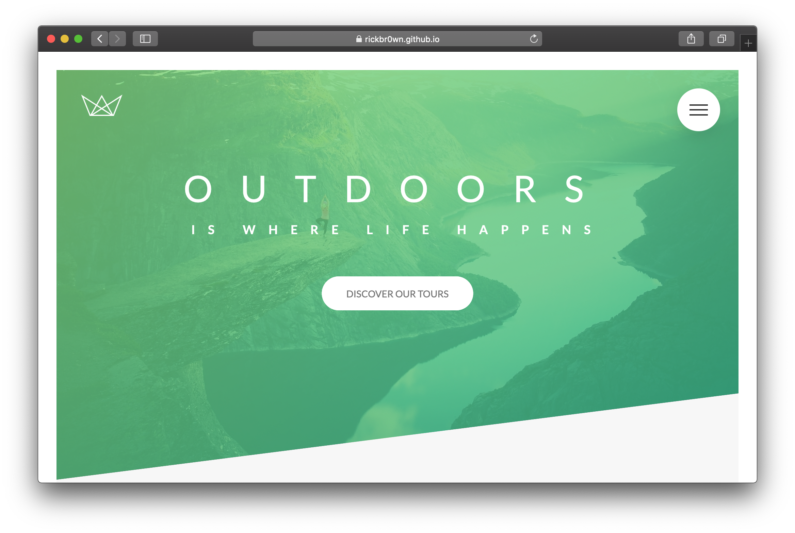
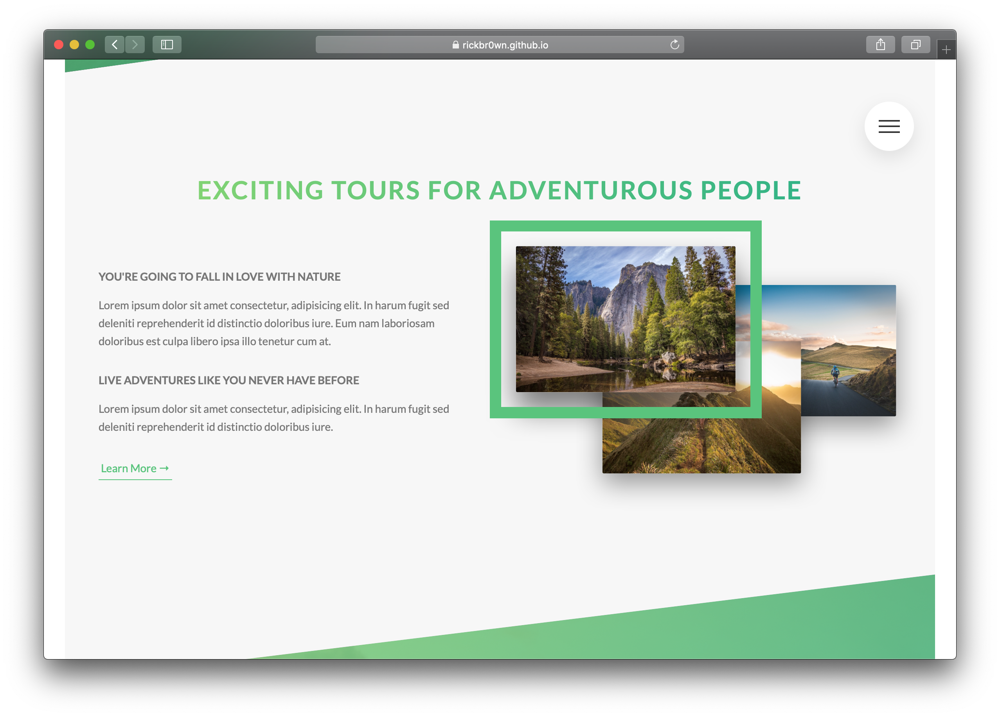
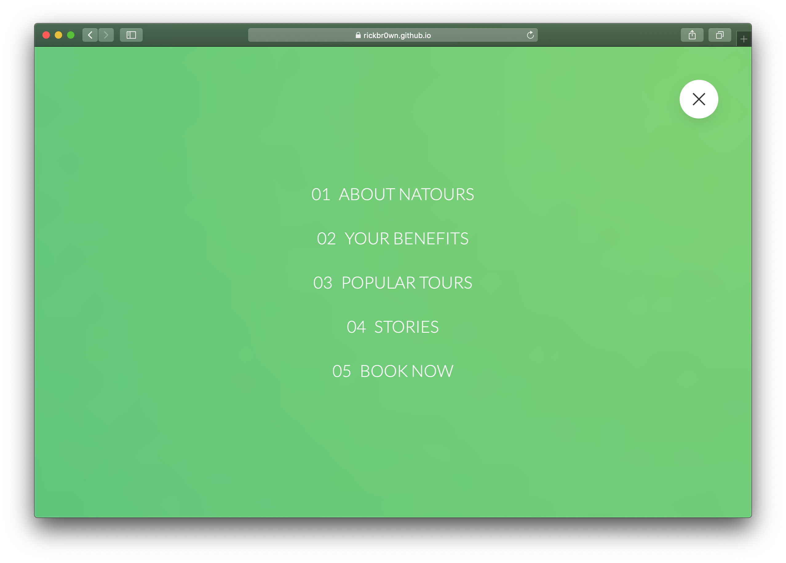

[

# Natours

This is a mock website for a company that sells tours. I completed it as part of the [Advanced CSS & SASS](https://www.udemy.com/advanced-css-and-sass/) course by [Jonas Schmedtmann](https://www.udemy.com/user/jonasschmedtmann/)

## Getting Started

This project is written is HTML/CSS/SASS, so nothing more is needed to get started other than viewing on [GitHub Pages
](https://rickbr0wn.github.io/natours/)

## Built With

- [HTML](https://developer.mozilla.org/en-US/docs/Web/HTML) - Hypertext Markup Language (**HTML**) is the standard markup language for creating web pages and web applications.
- [SASS](https://sass-lang.com) - Sass is the most mature, stable, and powerful professional grade CSS extension language in the world.
- [NODE-SASS](https://www.npmjs.com/package/node-sass) - A library that provides binding for Node.js to [LibSass](https://github.com/sass/libsass), the C version of the popular stylesheet preprocessor, Sass.

## Contributing

Please read [CONTRIBUTING.md](https://github.com/RickBr0wn/natours/blob/master/CONTRIBUTING.md) for details on our code of conduct, and the process for submitting pull requests to me.

## Authors

- **Rick Brown** - _Initial work_ - [Jonas Schmedtmann](https://www.udemy.com/user/jonasschmedtmann/)

## License

This project is licensed under the MIT License - see the [LICENSE.md](LICENSE.md) file for details

## Acknowledgments

- [Jonas Schmedtmann](https://www.udemy.com/user/jonasschmedtmann/)
  ](# Natours

This is a mock website for a company that sells tours. I completed it as part of the [Advanced CSS & SASS](https://www.udemy.com/advanced-css-and-sass/) course by [Jonas Schmedtmann](https://www.udemy.com/user/jonasschmedtmann/)

## Getting Started

This project is written is HTML/CSS/SASS, so nothing more is needed to get started other than viewing on [GitHub Pages
](https://rickbr0wn.github.io/natours/)

These instructions though, will get you a copy of the project up and running on your local machine for development and testing purposes. See deployment for notes on how to deploy the project on a live system.

### Prerequisites

A local server to 'host' the mock site. I used [live-server.
](https://www.npmjs.com/package/live-server)

### Installing

Clone the repository

```
git clone https://github.com/RickBr0wn/natours.git && cd natours
```

When cloned, install the dev-dependencies

```
npm i
```

When completed spin up using your chosen web server.

## ScreenShots





## Built With

- [HTML](https://developer.mozilla.org/en-US/docs/Web/HTML) - Hypertext Markup Language (**HTML**) is the standard markup language for creating web pages and web applications.
- [SASS](https://sass-lang.com) - Sass is the most mature, stable, and powerful professional grade CSS extension language in the world.
- [NODE-SASS](https://www.npmjs.com/package/node-sass) - A library that provides binding for Node.js to [LibSass](https://github.com/sass/libsass), the C version of the popular stylesheet preprocessor, Sass.

## Contributing

Please read [CONTRIBUTING.md](https://gist.github.com/PurpleBooth/b24679402957c63ec426) for details on our code of conduct, and the process for submitting pull requests to us.

## Authors

- **Rick Brown** - _Initial work_ - [Jonas Schmedtmann](https://www.udemy.com/user/jonasschmedtmann/)

## License

This project is licensed under the MIT License - see the [LICENSE.md](LICENSE.md) file for details

## Acknowledgments

- [Jonas Schmedtmann](https://www.udemy.com/user/jonasschmedtmann/)
  )
